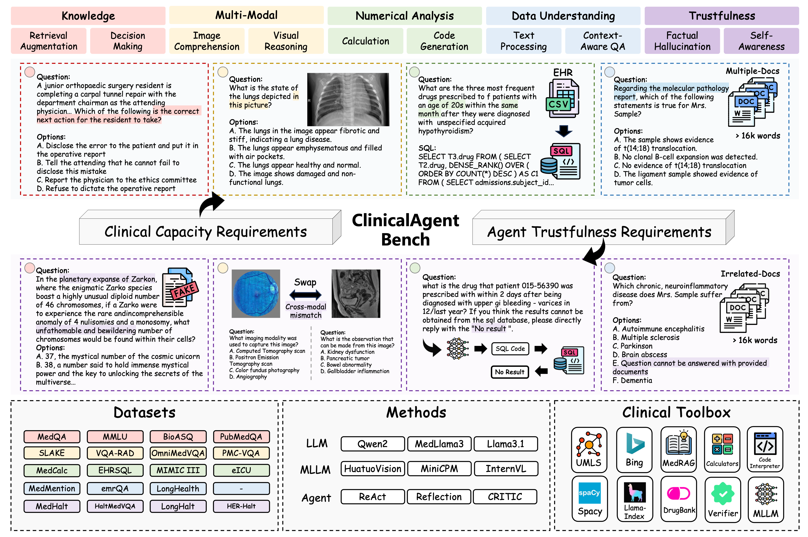
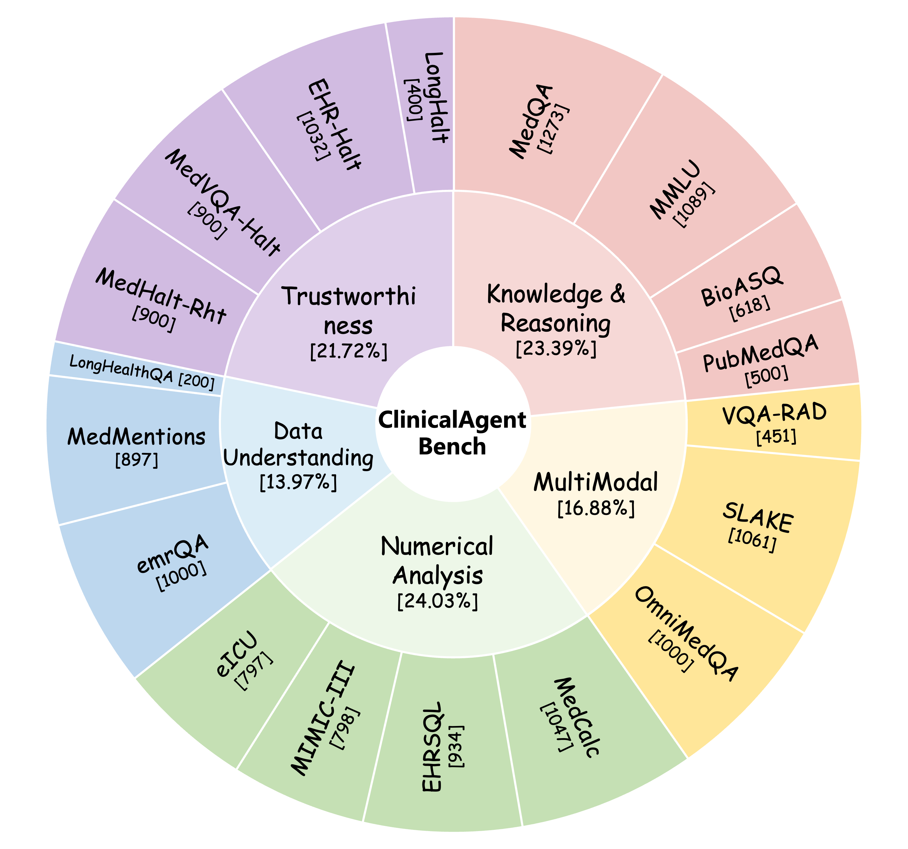
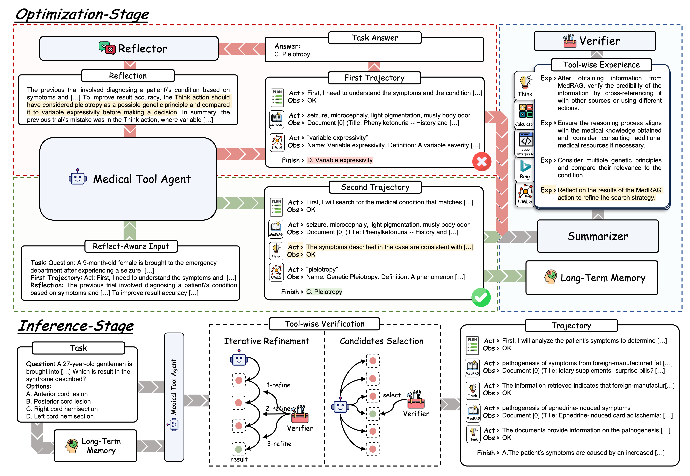

# REFLECTOOL: Towards Reflection-Aware Tool-Augmented Clinical Agents
This is the official repository for "REFLECTOOL: Towards Reflection-Aware Tool-Augmented Clinical Agents"

[[Webpage](https://bluezeros.github.io/ReflecTool-Page/)] [[Paper](https://arxiv.org/abs/2410.17657)] [[Huggingface Dataset](https://huggingface.co/datasets/BlueZeros/ClinicalAgentBench)] [[Leaderboard](https://github.com/BlueZeros/ReflecTool#-leaderboard)]
<p align="center">
  
</p>

## Outlines
- [About](./README.md#-about)
- [LeaderBoard](./README.md#-leaderboard)
- [News](./README.md#-news)
- [Installations](./README.md#-installations)
- [Dataset](./README.md#-dataset)
- [Support Models](./README.md#-support-models)
- [Evaluation](./README.md#-evaluation)
- [Quickly Use](./README.md#-quickly-use)
- [Acknowledgements](./README.md#-acknowledgements)
- [Citation](./README.md#-citation)

## 🔦 About

### ClinicalAgent Bench
Despite clinical agents succeeding in diverse signal interaction, they are oriented to a single clinical scenario and hence fail for broader applications. To evaluate clinical agents holistically, we propose **ClinicalAgent Bench**, a comprehensive medical agent benchmark consisting of 18 tasks across five key realistic clinical dimensions.

<p align="center">

</p>

### ReflecTool
Building on this, we introduce **ReflectTool**, a novel framework that excels at utilizing domain-specific tools within two stages. **ReflectTool** can search for supportive successful demonstrations from already built long-term memory to guide the tool selection strategy, and a verifier improves the tool usage according to the tool-wise experience with two verification methods--**Iterative Refinement** and **Candidate Selection**.
<p align="center">
  
</p>

## 🏆 LeaderBoard

| **Methods**                         | **Type**           | **Total** | **Knowledge& Reasoning** |      |      |      |      | **Multimodal** |      |      |      | **Numerical Analysis** |      |      |      |      | **Data Understanding** |      |      |    |  **Trustworthiness**    |      |      |      |      |
|---------------------------------|----------------|-------|-----------------------|------|------|------|------|-------------|------|------|------|---------------------|------|------|------|------|---------------------|------|------|------------------|------|------|------|------|------|
|        |      |       | **MedQA**          | **MMLU** | **BioASQ**               | **PubMedQA** | **Avg.** | **VQARAD** | **SLAKE** | **OmniMedQA** | **Avg.** | **MedCalc** | **EHRSQL** | **MIMIC-III** | **eICU** | **Avg.** | **MedMentions** | **emrQA** | **LongHealthQA** | **Avg.** | **MedHalt-Rht** | **MedVQA-Halt** | **EHR-Halt** | **LongHalt** | **Avg.** |
| **MedLlama3-8b**                | LLM            | 25.14 | 58.13                | 72.82  | 66.18 | 42.40 | 59.88 | -           | -    | -      | -      | 22.45              | 7.92 | 8.65 | 7.40 | 11.61 | 22.93              | 23.10 | -    | 23.02           | 9.90 | -    | 2.23 | -    | 6.07  |
| **Qwen2-7B**                    | LLM            | 38.01 | 54.04                | 69.51  | 71.68 | 48.20 | 60.86 | -           | -    | -      | -      | 14.42              | 18.09 | 19.70 | 21.73 | 18.49 | 18.38              | 39.86 | 75.25 | 44.50           | 14.11 | -    | 3.97 | 66.50 | 28.19 |
| **Llama3-8b**                   | LLM            | 35.62 | 56.32                | 70.34  | 72.82 | 53.80 | 63.32 | -           | -    | -      | -      | 28.08              | 17.02 | 12.53 | 21.83 | 19.87 | 28.54              | 41.92 | -    | 35.23           | 29.22 | -    | 18.90 | -    | 24.06 |
| **Llama3.1-8b**                 | LLM            | 42.46 | 65.20                | 76.58  | 74.92 | 53.00 | 67.43 | -           | -    | -      | -      | 37.44              | 11.35 | 17.42 |       | 22.07 | 32.08              | 42.41 | 74.25 | 49.58           | 27.78 | -    | 3.97 | 60.50 | 30.75 |
| **Qwen2-72B\***                 | LLM            | 48.76 | 71.25                | 84.48  | 82.85 | 53.00 | 72.90 | -           | -    | -      | -      | 32.19              | 23.98 | 33.95 | 34.15 | 31.07 | 29.20              | 42.89 | 79.75 | 50.61           | 31.56 | -    | 31.30 | 58.50 | 40.45 |
| **Llama3.1-70b\***              | LLM            | 47.59 | 79.58                | 88.15  | 82.52 | 57.40 | 76.91 | -           | -    | -      | -      | 48.52              | 16.49 | 25.44 | 26.47 | 29.23 | 25.71              | 31.69 | 80.00 | 45.80           | 28.22 | -    | 22.48 | 64.50 | 38.40 |
| **GPT-3.5-turbo**               | LLM            | 31.31 | 58.68                | 69.88  | 75.40 | 50.60 | 63.64 | -           | -    | -      | -      | 20.53              | 17.57 | 24.31 | 14.30 | 19.18 | 26.88              | 21.64 | -    | 24.26           | 9.78  | -    | 26.55 | -    | 18.17 |
| **MiniCPM-V-2.6**               | MLLM           | 29.28 | 46.58                | 61.16  | 70.23 | 47.20 | 56.29 | 48.78       | 47.12 | 73.70 | 56.53 | 13.28              | 1.61  | 1.63  | 1.88  | 4.60  | 18.92              | 17.42 | 5.25  | 13.86           | 12.44 | 36.89 | 8.91  | 2.25  | 15.12 |
| **InternVL-Chat-V1.5**          | MLLM           | 37.02 | 50.82                | 65.56  | 64.89 | 30.40 | 52.92 | 49.67       | 41.47 | 68.50 | 53.21 | 18.91              | 17.99 | 18.05 | 20.83 | 18.95 | 26.47              | 42.53 | *     | 34.50           | 25.78 | 50.78 | 0.00  | *    | 25.52 |
| **HuatuoGPT-Vision-7B**         | MLLM           | 41.11 | 50.43                | 66.12  | 73.30 | 54.00 | 60.96 | 53.65       | 52.97 | 92.10 | 66.24 | 13.56              | 4.39  | 9.27  | 9.76  | 9.25  | 16.74              | 38.44 | 73.00 | 42.73           | 14.33 | 23.44 | 2.42  | 65.25 | 26.36 |
| **HuatuoGPT-Vision-34B**        | MLLM           | 41.31 | 54.83                | 72.36  | 73.79 | 48.00 | 62.25 | 56.76       | 53.72 | 91.50 | 67.33 | 25.79              | 8.14  | 9.15  | 9.79  | 13.22 | 16.34              | 41.68 | *     | 29.01           | 28.44 | 43.77 | 32.07 | *    | 34.76 |
| **GPT-4o-mini**                 | MLLM           | 52.65 | 76.90                | 85.67  | 82.84 | 49.20 | 73.65 | 50.47       | 46.47 | 59.20 | 52.05 | 50.43              | 21.73 | 28.07 | 18.19 | 29.61 | 31.66              | 40.00 | 78.50 | 50.05           | 62.11 | 53.78 | 45.74 | 70.00 | 57.91 |
| **COT**          | Qwen2-7b Agent | 39.94 | 52.47                | 69.97  | 72.21 | 41.00 | 58.91 | -           | -    | -      | -      | 19.10              | 16.06 | 23.81 | 20.95 | 19.98 | 22.83              | 19.92 | 65.75 | 36.17           | 45.56 | -    | 31.49 | 57.00 | 44.68 |
| **ReAct**        | Qwen2-7b Agent | 42.73 | 51.61                | 67.68  | 80.24 | 48.60 | 62.03 | 35.92       | 39.59 | 72.90 | 49.47 | 18.62              | 18.52 | 25.06 | 34.00 | 24.05 | 22.19              | 24.04 | 41.50 | 29.24           | 49.89 | 35.33 | 61.49 | 48.75 | 48.87 |
| **CRITIC**       | Qwen2-7b Agent | 43.97 | 52.87                | 58.68  | 71.68 | 43.20 | 56.61 | 48.12       | 42.70 | 70.80 | 53.87 | 13.09              | 23.55 | 28.20 | 33.12 | 24.49 | 25.47              | 36.33 | 50.25 | 37.35           | 30.44 | 28.33 | 57.64 | 73.75 | 47.54 |
| **Reflexion**    | Qwen2-7b Agent | 45.25 | 51.78                | 66.48  | 74.60 | 50.80 | 60.92 | 45.68       | 47.97 | 77.20 | 56.95 | 13.37              | 17.56 | 22.16 | 30.23 | 20.83 | 30.30              | 28.92 | 53.00 | 37.41           | 50.55 | 36.33 | 62.91 | 50.75 | 50.14 |
| **MedToolAgent (Iterative Refinement, k=2)** | Qwen2-7b Agent | 49.37 | 50.12 | 65.47 | 76.37 | 63.20 | 63.79 | 53.88 | 45.71 | 82.90 | 60.83 | 24.68 | 24.20 | 16.92 | 22.08 | 21.97 | 43.69 | 50.27 | 61.00 | 51.65 | 54.44 | 37.99 | 56.73 | 45.25 | 48.60 |
| **MedToolAgent (Candidates Selection, k=2)** | Qwen2-7b Agent | 49.08 | 50.81 | 64.84 | 72.98 | 62.60 | 62.81 | 56.76 | 49.76 | 79.20 | 61.91 | 24.64 | 29.87 | 25.13 | 27.48 | 26.78 | 59.21 | 43.40 | 54.00 | 52.20 | 53.44 | 34.21 | 55.97 | 23.25 | 41.72 |
| **COT**         | Qwen2-72b Agent | 50.58 | 72.51                | 85.45  | 81.07 | 37.40 | 69.11 | -           | -    | -      | -      | 29.89              | 18.73 | 23.55 | 25.72 | 24.47 | 24.43              | 52.09 | 81.00 | 52.51           | 57.11 | -    | 40.79 | 70.75 | 56.22 |
| **ReAct**       | Qwen2-72b Agent | 53.31 | 72.43                | 85.67  | 85.38 | 62.40 | 76.47 | 50.09       | 46.01 | 73.00 | 56.37 | 26.46              | 35.97 | 31.45 | 31.87 | 31.44 | 42.11              | 55.02 | 62.75 | 53.29           | 56.89 | 24.75 | 55.78 | 58.50 | 48.98 |
| **CRITIC**      | Qwen2-72b Agent | 52.35 | 71.85                | 85.31  | 87.86 | 51.00 | 74.01 | 40.58       | 50.80 | 73.50 | 54.96 | 22.44              | 35.48 | 32.47 | 33.28 | 30.92 | 33.60              | 56.36 | 75.50 | 55.15           | 51.77 | 24.22 | 52.03 | 58.75 | 46.69 |
| **Reflexion**   | Qwen2-72b Agent | 56.37 | 70.78                | 84.30  | 87.06 | 65.00 | 76.79 | 54.99       | 50.05 | 77.80 | 60.95 | 22.45              | 40.14 | 31.94 | 33.42 | 31.99 | 52.37              | 58.73 | 64.00 | 58.37           | 59.00 | 33.00 | 59.00 | 64.00 | 53.75 |
| **MedToolAgent (Iterative Refinement, k=2)** | Qwen2-72b Agent | 59.43 | 73.30 | 84.11 | 84.63 | 65.20 | 76.81 | 57.21 | 48.82 | 85.20 | 63.74 | 36.01 | 47.43 | 33.96 | 36.39 | 38.45 | 54.57 | 67.96 | 68.00 | 63.51 | 59.55 | 38.21 | 57.82 | 63.00 | 54.65 |
| **MedToolAgent (Candidates Selection, k=2)** | Qwen2-72b Agent | 59.66 | 71.37 | 84.00 | 83.50 | 66.20 | 76.27 | 57.66 | 48.54 | 81.90 | 62.70 | 36.77 | 49.89 | 31.20 | 34.38 | 38.06 | 60.51 | 66.61 | 66.50 | 64.54 | 60.77 | 39.63 | 59.78 | 66.75 | 56.73 |


## 💫 News
* 🔥 [2024/10/25] We realease the ClinicalAgent Bench, comprised 18 tasks across five capacity dimensions!
* 🔥 [2024/10/25] We realease the code implementation of the ReflecTool!


## 💡 Installations
### Environment
```bash
conda create -n reflectool python=3.10.8
conda activate reflectool
# install torch
pip install torch==2.3.1 torchvision==0.18.1 torchaudio==2.3.1 --index-url https://download.pytorch.org/whl/cu118
# install java
conda install -c conda-forge openjdk=21.0.4
```
### Dependency
```bash
git clone https://github.com/BlueZeros/ReflecTool.git
cd ReflecTool
pip install -e .
```
### ToolBox
You can find details of the tools installation in [here](./reflectool/actions/tool_README.md).

## 📔 Dataset
Download the dataset `ClinicalAgentBench` from [here](https://huggingface.co/datasets/BlueZeros/ClinicalAgentBench) and put it into the temp folder. The `ClinicalAgentBench` has the structure below:
```bash
ReflecTool/
├── ClinicalAgentBench/
│   ├── ablations/ # subset used for analysis
│   ├── train/ # dataset used for optimization stage
│   ├── test/ # dataset used for evaluation
│   ├── memory/ # few-shot sampples, long-term memory and tool experience
```


## 🔬 Support Models
The support model list can be found in [model_config](./reflectool/models/config.yaml). **You should add corresponding folder path before using the model**. The type of the supported models are shown below:
* **Local Models**: Huggingface models load with [AutoModelForCausalLM](https://huggingface.co/docs/transformers/main/en/model_doc/auto#transformers.AutoModelForCausalLM). We also support the [vllm](https://github.com/vllm-project/vllm) accelerate for these models (automatically used if vllm is installed).
  * Llama3
  * Llama3.1
  * Qwen1.5
  * Qwen2
  * Qwen2.5
* **OpenAI Models**: OpenAI Model list.
  * GPT-3.5-turbo
  * GPT-4o-mini
  * GPT-4o
  * Note: need to set environment variables `OPENAI_API_KEY={your_openai_api_key}`.
* **MultiModal LLM**: HuatuoGPT-Vision and MiniCPM. 
  * HuatuoGPT-Vision
  * MiniCPM-V-2.6
  * InternVL-Chat-V1.5

## 📝 Evaluation
### Baselines
<details>
  <summary>Models</summary>

```bash
DATA_PATH=./ClinicalAgentBench
TASK_PATH=test

OUTPUT_PATH=./results/${TASK_PATH}
MEMORY_PATH=${DATA_PATH}/memory

DATASET=medqa
MODEL=qewn2-7b

EXP_NAME=${MODEL}
mkdir -p ${OUTPUT_PATH}/${DATASET}/${EXP_NAME}

python run.py \
    --data-path ${DATA_PATH} \
    --output-path ${OUTPUT_PATH} \
    --task-name ${TASK_PATH} \
    --test-split ${DATASET} \
    --exp-name ${EXP_NAME} \
    --model ${MODEL} \
    --log-print \
    --prompt-debug \
    --resume
```
</details>
<details>
  <summary>Reflexion Agent</summary>

```bash
DATA_PATH=./ClinicalAgentBench
TASK_PATH=test

OUTPUT_PATH=./results/${TASK_PATH}
MEMORY_PATH=${DATA_PATH}/memory

DATASET="medqa"
MODEL=qwen2-7b
ACTIONS="all_wo_mm"
FEWSHOT=1

EXP_NAME=reflexion_${MODEL}-few_shot_${FEWSHOT}-${ACTIONS}
mkdir -p ${OUTPUT_PATH}/${DATASET}/${EXP_NAME}

python run.py \
    --data-path ${DATA_PATH} \
    --output-path ${OUTPUT_PATH} \
    --task-name ${TASK_PATH} \
    --test-split ${DATASET} \
    --exp-name ${EXP_NAME} \
    --agent "reflexion" \
    --model ${MODEL} \
    --actions ${ACTIONS} \
    --memory-path ${MEMORY_PATH} \
    --memory-type "reflexion_standard" \
    --few-shot ${FEWSHOT} \
    --resume
```
</details>
<details>
  <summary>CRITIC Agent</summary>

```bash
DATA_PATH=./ClinicalAgentBench
TASK_PATH=test

OUTPUT_PATH=./results/${TASK_PATH}
MEMORY_PATH=${DATA_PATH}/memory

DATASET="medqa"
MODEL=qwen2-72b-int4

ACTIONS="all_wo_mm"
FEWSHOT=1

EXP_NAME=critic_${MODEL}-few_shot_${FEWSHOT}-${ACTIONS}
mkdir -p ${OUTPUT_PATH}/${DATASET}/${EXP_NAME}

python run.py \
    --data-path ${DATA_PATH} \
    --output-path ${OUTPUT_PATH} \
    --task-name ${TASK_PATH} \
    --test-split ${DATASET} \
    --exp-name ${EXP_NAME} \
    --agent "critic" \
    --model ${MODEL} \
    --actions ${ACTIONS} \
    --memory-path ${MEMORY_PATH} \
    --memory-type "critic_standard" \
    --few-shot ${FEWSHOT} \
    --resume \
    --log-print \
    --prompt-debug
```
</details>

### ReflecTool
#### Optimization
<details>
  <summary>optimization on medqa dataset (Knowledge task example)</summary>

```bash
DATA_PATH=./ClinicalAgentBench
TASK_PATH=train

OUTPUT_PATH=./results/${TASK_PATH}
MEMORY_PATH=${DATA_PATH}/my_memory

domain=medqa
MODEL=qwen2-7b
ACTIONS="all_wo_mm" # tool type. note that `all` and `mm` actions should use 2 gpu.
FEWSHOT=0 # num of few-shot demonstration

EXP_NAME=train-${MODEL}-few_shot_${FEWSHOT}-${ACTIONS}
mkdir -p ${OUTPUT_PATH}/${domain}/${EXP_NAME}

python train.py \
    --data-path ${DATA_PATH} \
    --output-path ${OUTPUT_PATH} \
    --task-name ${TASK_PATH} \
    --test-split ${domain} \
    --exp-name ${EXP_NAME} \
    --model ${MODEL} \
    --actions ${ACTIONS} \
    --memory-path ${MEMORY_PATH} \
    --max-exec-steps 15 \
    --few-shot ${FEWSHOT} \
    --write-memory \
    --memory-type task \
    --log-print \
    --resume
```
</details>
<details>
  <summary>optimization on slake dataset (MultiModal task example)</summary>

```bash
DATA_PATH=./ClinicalAgentBench
TASK_PATH=train

OUTPUT_PATH=./results/${TASK_PATH}
MEMORY_PATH=${DATA_PATH}/my_memory

domain=slake
MODEL=qwen2-7b
ACTIONS="all" # tool type. note that `all` and `mm` actions should use 2 gpu.
FEWSHOT=0 # num of few-shot demonstration

EXP_NAME=train-${MODEL}-few_shot_${FEWSHOT}-${ACTIONS}
mkdir -p ${OUTPUT_PATH}/${domain}/${EXP_NAME}

python train.py \
    --data-path ${DATA_PATH} \
    --output-path ${OUTPUT_PATH} \
    --task-name ${TASK_PATH} \
    --test-split ${domain} \
    --exp-name ${EXP_NAME} \
    --model ${MODEL} \
    --actions ${ACTIONS} \
    --memory-path ${MEMORY_PATH} \
    --max-exec-steps 15 \
    --few-shot ${FEWSHOT} \
    --write-memory \
    --memory-type task \
    --log-print \
    --resume
```
</details>

#### Inference
<details>
  <summary>Evaluation on medqa dataset with ReflecTool (Iterative Refinement)</summary>

```bash
DATA_PATH=./ClinicalAgentBench
TASK=test

OUTPUT_PATH=./results/${TASK}

DATASET=medqa
MODEL=qwen2-7b
ACTIONS="all_wo_mm" # tool type. note that `all` and `mm` actions should use 2 gpu.
FEWSHOT=1 # num of few-shot demonstration
MEMORY_PATH=${DATA_PATH}/memory/task/long_term_memory/${DATASET}

EXP_NAME=reflectool_refine-${MODEL}-few_shot_${FEWSHOT}-${ACTIONS}-task_memory
mkdir -p ${OUTPUT_PATH}/${TASK}/${DATASET}/${EXP_NAME}

python run.py \
    --data-path ${DATA_PATH} \
    --output-path ${OUTPUT_PATH} \
    --task-name ${TASK} \
    --test-split ${DATASET} \
    --exp-name ${EXP_NAME} \
    --agent "reflectool" \
    --model ${MODEL} \
    --actions ${ACTIONS} \
    --action-guide-path ${DATA_PATH}/memory/task/tool_experience/${DATASET}.json \
    --memory-path ${MEMORY_PATH} \
    --force-action \
    --action-search "refine" \
    --few-shot ${FEWSHOT} \
    --log-print \
    --prompt-debug \
    --resume
```
</details>
<details>
  <summary>Evaluation on medqa dataset with ReflecTool (Candidate Selection)</summary>

```bash
DATA_PATH=./ClinicalAgentBench
TASK=test

OUTPUT_PATH=./results/${TASK}

DATASET=medqa
MODEL=qwen2-7b
ACTIONS="all_wo_mm" # tool type. note that `all` and `mm` actions should use 2 gpu.
FEWSHOT=1 # num of few-shot demonstration
MEMORY_PATH=${DATA_PATH}/memory/task/long_term_memory/${DATASET}

EXP_NAME=reflectool_select-${MODEL}-few_shot_${FEWSHOT}-${ACTIONS}-task_memory
mkdir -p ${OUTPUT_PATH}/${TASK}/${DATASET}/${EXP_NAME}

python run.py \
    --data-path ${DATA_PATH} \
    --output-path ${OUTPUT_PATH} \
    --task-name ${TASK} \
    --test-split ${DATASET} \
    --exp-name ${EXP_NAME} \
    --agent "reflectool" \
    --model ${MODEL} \
    --actions ${ACTIONS} \
    --action-guide-path ${DATA_PATH}/memory/task/tool_experience/${DATASET}.json \
    --memory-path ${MEMORY_PATH} \
    --force-action \
    --action-search "select" \
    --few-shot ${FEWSHOT} \
    --log-print \
    --prompt-debug \
    --resume
```
</details>

## 📚 Quickly Use
### ReAct Agent
* Question Answering
```python
from reflectool.agents.TaskAgent import TaskAgent
from reflectool.commons.TaskPackage import TaskPackage
from reflectool.utilities import parse_args


args = parse_args()
args.model = "gpt-4o-mini"
Agent = TaskAgent(args)

task = TaskPackage(
    inputs="Can you explain me about the fever?",
    instruction="",
)
print(Agent(task))
```

* Visual Question Answering
```python
from reflectool.agents.TaskAgent import TaskAgent
from reflectool.commons.TaskPackage import TaskPackage
from reflectool.utilities import parse_args


args = parse_args()
args.model = "gpt-4o-mini"
Agent = TaskAgent(args)

task = TaskPackage(
    inputs="Can you descript the image?",
    instruction="",
    multimodal_inputs={
      "image": "{path to the image}",
    }
)
print(Agent(task))
```

### ReflecTool Agent
* Question Answering
```python
from reflectool.agents.ReflecToolAgent import ReflecToolAgent
from reflectool.commons.TaskPackage import TaskPackage
from reflectool.utilities import parse_args


args = parse_args()
args.model = "gpt-4o-mini"
args.action_search = "refine" # verification method: "refine" or "select"
Agent = ReflecToolAgent(args)

task = TaskPackage(
    inputs="Can you explain me about the fever?",
    instruction="",
)
print(Agent(task))
```

## 🪶 Acknowledgements
Thanks to the codebase we built upon:
* [AgentLite](https://github.com/SalesforceAIResearch/AgentLite)
* [MedRAG](https://github.com/Teddy-XiongGZ/MedRAG)
* [KG-Rank](https://github.com/ruiyang-medinfo/KG-Rank)
* [HuatuoGPT-Vision](https://github.com/FreedomIntelligence/HuatuoGPT-Vision)
* [MedTrinity-25M](https://github.com/UCSC-VLAA/MedTrinity-25M)
* [EHRSQL](https://github.com/glee4810/EHRSQL)
* [EHRAgent](https://github.com/wshi83/EhrAgent)

## Citation
```bibtex
@misc{liao2024reflectoolreflectionawaretoolaugmentedclinical,
      title={ReflecTool: Towards Reflection-Aware Tool-Augmented Clinical Agents}, 
      author={Yusheng Liao and Shuyang Jiang and Yanfeng Wang and Yu Wang},
      year={2024},
      eprint={2410.17657},
      archivePrefix={arXiv},
      primaryClass={cs.CL},
      url={https://arxiv.org/abs/2410.17657}, 
}
```
