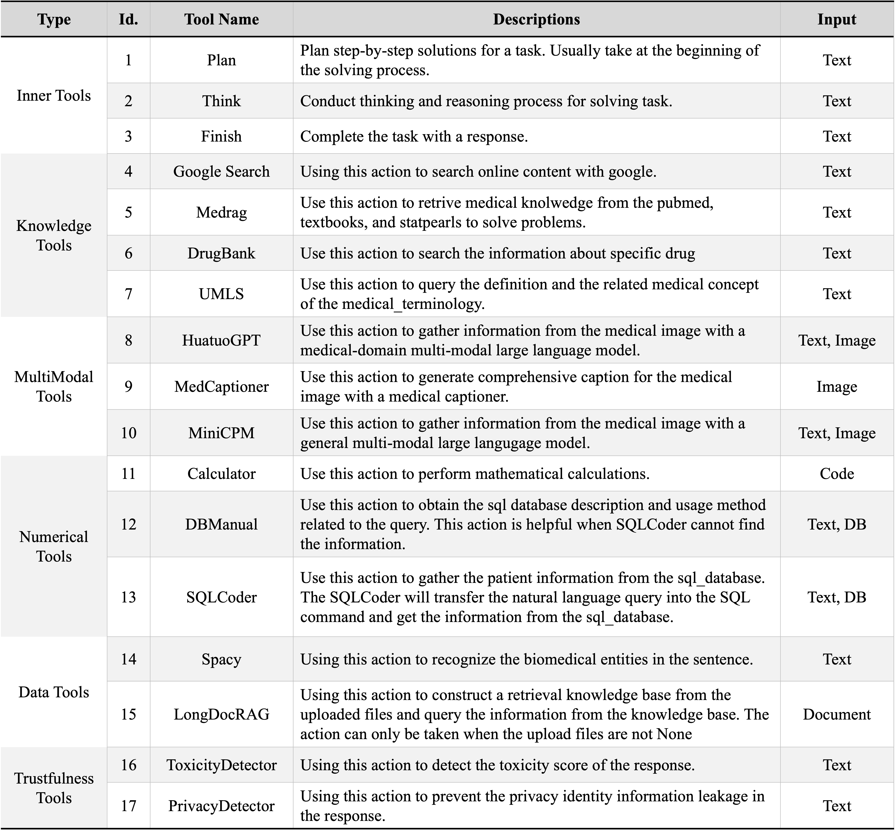

# Tool Installation
<p align="center">
  
</p>

## Knowledge & Reasoning
### Medrag
Medrag retrieves medical knowledge from the medical knowledge base collected by [MedRAG](https://github.com/Teddy-XiongGZ/MedRAG/tree/main). The medcrops will be automatically downloaded when initializing the code for the first time. You can modify the `db_dir` of the medrag at [here](./MedRAG.py#L350) to change the save path of the medcrops.

### UMLS
The UMLS tools need to registration in  the [NIH website](https://uts.nlm.nih.gov/uts/) and get the API key. The API key don't need to apply can can be found directly in teh Get Your API Key colum in the upper right corner of the website. You can set the API key as the environment variable in the terminal and put it into the `~/.bashrc` for easy usage.
```bash
UMLS_API_KEY={your_umls_api_key}
```

### DrugBank
The drugbank database can be obtained from the [DrugBank](https://go.drugbank.com/releases/latest). You need to apply to use it for the academic reseach and put it into the `./drugbank/drugbank.pkl`. You can also modify the path of `drugbank.pkl` at [here](./DrugBank.py#L25).

### GoogleSearch
No operations.

## MultiModal
We choose three MultiModal Large Language Models (MLLMs) as the MultiModal tools. Download the models and add the folder path into the [model_config](../models/config.yaml). Enabling multimodal tools requires at least two A100s. You can disable these tools by using the parameter `--action "all_wo_mm"`.
* [HuatuoGPT-Vision-7B](https://huggingface.co/FreedomIntelligence/HuatuoGPT-Vision-7B)
* [MiniCPM-V-2.6](https://huggingface.co/openbmb/MiniCPM-V-2_6)
* [LLaVA-Med-Captioner](https://huggingface.co/UCSC-VLAA/LLaVA-Med-Captioner)

## Numerical Analysis
no operations.


## Data Understanding
### Spacy
We adopt [en_core_sci_sm](https://s3-us-west-2.amazonaws.com/ai2-s2-scispacy/releases/v0.5.4/en_core_sci_sm-0.5.4.tar.gz) as the name entity recognization model. You can also choose other type of models [here](https://allenai.github.io/scispacy). Download the model and install it with `pip`:
```bash
pip install {path_to_ner_model}
```
### LongDocRAG
LongDocRAG adopts GPT-3.5-turbo as the chatbot and requires OpenAI API key and the proxy. You need to set the OpenAI API key and proxy as environment variables as follows:
```bash
OPENAI_API_KEY={your_openai_api_key}
http_proxy={proxy_url}
https_proxy={proxy_url}
```
